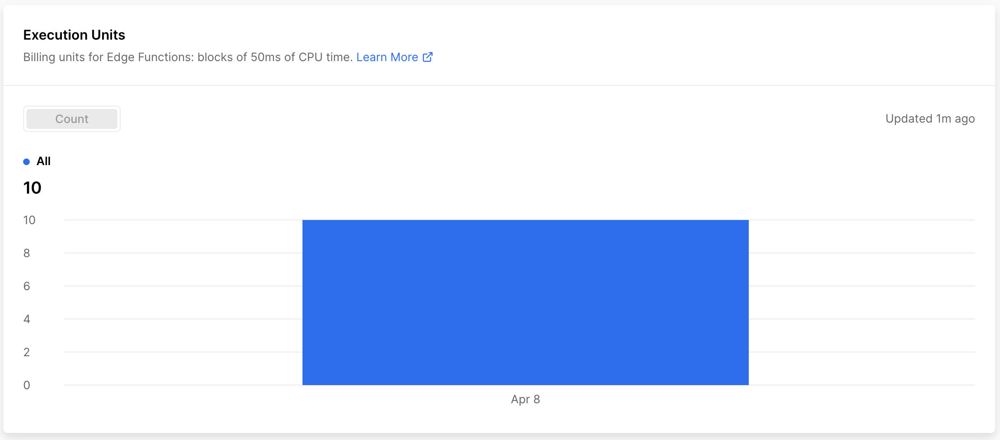

# GPT Edge Test

Test the difference in performance and cost on Vercel for running GPT calls through edge functions vs. serverless.

## Results

The time to call the functions were roughly the same, with maybe a 5-10% performance benefit to using Edge functions, although that could just be OpenAI variation.

### Serverless Functions

The serverless functions used roughtly 0.025 GB-Hrs for 10 calls. 

Vercel [bills](https://vercel.com/pricing) serverless functions at $40/100 GB-Hrs, so our 10 serverless calls cost 1 cent.

### Edge Functions

The edge functions used 10 execution units for 10 calls.

Vercel [bills](https://vercel.com/pricing) edge functions at $2/million execution units, so our 10 edge calls cost 0.002 cents.

### Comparison

The edge functions cost 500x less than the serverless functions.

Edge functions are a bit harder to write because they use web rather than express APIs, and you need to pass in a fetch adapter for axios for openai's npm package.

But the differences are so big you should be using edge functions for any kind of OpenAI application that gets a decent amount of traffic.

ReadPanda https://readpanda.ai ❤️ Vercel